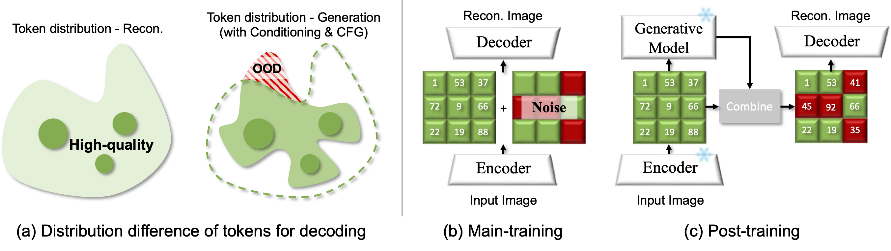

## Image Tokenizer Needs Post-Training

<div align="center">

[](https://qiuk2.github.io/works/RobusTok/index.html)&nbsp;
[](https://arxiv.org/abs/2509.12474)&nbsp;
[](https://huggingface.co/qiuk6/RobusTok)&nbsp;

</div>

<div align="center">
  
</div>

---

## TL;DR

We present RobusTok, a new image tokenizer with a two-stage training scheme:

Main training → constructs a robust latent space.

Post-training → aligns the generator’s latent distribution with its image space.

## Key highlights of Post-Training

- 🚀 **Better generative quality**: gFID 1.60 → 1.36.
- 🔑 **Generalizability**: applicable to both autoregressive & diffusion models.
- ⚡ **Efficiency**: strong results with only ~400M generative models.

---

## Model Zoo
| Generator \ Tokenizer | RobusTok w/o. P.T([weights](https://huggingface.co/qiuk6/RobusTok/resolve/main/main-train.pt?download=true)) | RobusTok w/. P.T ([weights](https://huggingface.co/qiuk6/RobusTok/resolve/main/post-train.pt?download=true)) |
|---|---:|---:|
| Base ([weights](https://huggingface.co/qiuk6/RobusTok/resolve/main/rar_b.bin?download=true)) | gFID = 1.83 | gFID = 1.60 |
| Large ([weights](https://huggingface.co/qiuk6/RobusTok/resolve/main/rar_l.bin?download=true)) | gFID = 1.60 | gFID = 1.36 |

---

## Updates
- (2025.09.16) Paper released in Arxiv.
- (2025.09.18) Code and checkpoint are released. Preparing for PFID calculation

---

## Instellation

Install all packages as

```
conda env create -f environment.yml
```

---

## Dataset

We download the ImageNet2012 from the website and collect it as

```
ImageNet2012
├── train
└── val
```

If you want to train or finetune on other datasets, collect them in the format that ImageFolder (pytorch's [ImageFolder](https://pytorch.org/vision/main/generated/torchvision.datasets.ImageFolder.html)) can recognize.

```
Dataset
├── train
│   ├── Class1
│   │   ├── 1.png
│   │   └── 2.png
│   ├── Class2
│   │   ├── 1.png
│   │   └── 2.png
├── val
```

---

## Main Train for tokenizer

Please login to Wandb first using

```
wandb login
```

rFID will be automatically evaluated and reported on Wandb. The checkpoint with the best rFID on the val set will be saved. We provide basic configurations in the "configs" folder. 

Warning❗️: You may want to modify the metric to save models as rFID is not closely correlated to gFID. PSNR and SSIM are also good choices.

```
torchrun --nproc_per_node=8 tokenizer/tokenizer_image/main_train.py --config configs/main-train.yaml
```

Please modify the configuration file as needed for your specific dataset. We list some important ones here.

```
vq_ckpt: ckpt_best.pt                # resume
cloud_save_path: output/exp-xx       # output dir
data_path: ImageNet2012/train        # training set dir
val_data_path: ImageNet2012/val      # val set dir
enc_tuning_method: 'full'            # ['full', 'lora', 'frozen']
dec_tuning_method: 'full'            # ['full', 'lora', 'frozen']
codebook_embed_dim: 32               # codebook dim
codebook_size: 4096                  # codebook size
product_quant: 1                     # vanilla VQ
v_patch_nums: [16,]                  # latent resolution for RQ ([16,] is equivalent to vanilla VQ)
codebook_drop: 0.1                   # quantizer dropout rate if RQ is applied
semantic_guide: dinov2               # ['none', 'dinov2', 'clip']
disc_epoch_start: 56	             # epoch that discriminator starts
disc_type: dinodisc		     # discriminator type
disc_adaptive_weight: true	     # adaptive weight for discriminator loss
ema: true                            # use ema to update the model
num_latent_code: 256		     # latent token number (must equals to the v_patch_nums[-1] ** 2）
```
---

## Training code for Generator

We follow [RAR](https://github.com/bytedance/1d-tokenizer) to pretokenize the whole dataset for speed-up the training process. We have uploaded [it](https://huggingface.co/qiuk6/RobustTok/resolve/main/RobustTok-half-pretokenized.jsonl?download=true) so you can train RobusTok-RAR directly.


```
# training code for rar-b
accelerate launch scripts/train_rar.py experiment.project="rar" experiment.name="rar_b" experiment.output_dir="rar_b" model.generator.hidden_size=768 model.generator.num_hidden_layers=24 model.generator.num_attention_heads=16 model.generator.intermediate_size=3072 config=configs/generator/rar.yaml dataset.params.pretokenization=/path/to/pretokenized.jsonl model.vq_ckpt=/path/to/RobustTok.pt

# training code for rar-l
accelerate launch scripts/train_rar.py experiment.project="rar" experiment.name="rar_l" experiment.output_dir="rar_l" model.generator.hidden_size=1024 model.generator.num_hidden_layers=24 model.generator.num_attention_heads=16 model.generator.intermediate_size=4096 config=configs/generator/rar.yaml dataset.params.pretokenization=/path/to/pretokenized.jsonl model.vq_ckpt=/path/to/RobustTok.pt
```

---

## Post-Training for Tokenizer

For post-training, we need to (1) prepare paired dataset and (2) post-train our decoder to align with generated latent space

### Prepare data
You can follow our code with your desired dataset / &sigma; / number to generate data 
```
torchrun --nnodes=1 --nproc_per_node=8 --rdzv-endpoint=localhost:9999 post_train_data.py config=configs/generator/rar.yaml \
    experiment.output_dir="/path/to/data-folder" \
    experiment.generator_checkpoint="rar_b.bin" \
    model.vq_ckpt=/path/to/RobustTok.pt \
    model.generator.hidden_size=768 \
    model.generator.num_hidden_layers=24 \
    model.generator.num_attention_heads=16 \
    model.generator.intermediate_size=3072 \
    model.generator.randomize_temperature=1.02 \
    model.generator.guidance_scale=6.0 \
    model.generator.guidance_scale_pow=1.15 \
    --sigma 0.7 --data-path /path/to/imagenet --num_samples /number/of/generate
```

### Post-Training

```
torchrun --nproc_per_node=8 tokenizer/tokenizer_image/xqgan_post_train.py --config configs/post-train.yaml --data-path /path/to/data-folder --pair-set /path/to/imagenet --vq-ckpt /path/to/main-train/ckpt
```

---

## Inference Code

```
# Reproducing RAR-B
torchrun --nnodes=1 --nproc_per_node=8 --rdzv-endpoint=localhost:9999 sample_imagenet_rar.py config=configs/generator/rar.yaml \
    experiment.output_dir="rar_b" \
    experiment.generator_checkpoint="rar_b.bin" \
    model.vq_ckpt=/path/to/RobustTok.pt \
    model.generator.hidden_size=768 \
    model.generator.num_hidden_layers=24 \
    model.generator.num_attention_heads=16 \
    model.generator.intermediate_size=3072 \
    model.generator.randomize_temperature=1.02 \
    model.generator.guidance_scale=6.0 \
    model.generator.guidance_scale_pow=1.15
# Run eval script. The result FID should be ~1.83 before post-training and ~1.60 after post-training
python3 evaluator.py VIRTUAL_imagenet256_labeled.npz rar_b.npz

# Reproducing RAR-L
torchrun --nnodes=1 --nproc_per_node=8 --rdzv-endpoint=localhost:9999 sample_imagenet_rar.py config=configs/generator/rar.yaml \
    experiment.output_dir="rar_l" \
    experiment.generator_checkpoint="rar_l.bin" \
    model.vq_ckpt=/path/to/RobustTok.pt \
    model.generator.hidden_size=1024 \
    model.generator.num_hidden_layers=24 \
    model.generator.num_attention_heads=16 \
    model.generator.intermediate_size=4096 \
    model.generator.randomize_temperature=1.04 \
    model.generator.guidance_scale=6.75 \
    model.generator.guidance_scale_pow=1.01
# Run eval script. The result FID should be ~1.60 before post-training and ~1.36 after post-training
python3 evaluator.py VIRTUAL_imagenet256_labeled.npz rar_l.npz
```

---

## Visualization

<div align="center">
  
  <p>
    visualization of 256&times;256 image generation before (top) and after (bottom) post-training. Three improvements are observed: (a) OOD mitigation, (b) Color fidelity, (c) detail refinement.
  </p>
</div>

---

## Citation

If our work assists your research, feel free to give us a star ⭐ or cite us using

```
@misc{qiu2025imagetokenizerneedsposttraining,
      title={Image Tokenizer Needs Post-Training}, 
      author={Kai Qiu and Xiang Li and Hao Chen and Jason Kuen and Xiaohao Xu and Jiuxiang Gu and Yinyi Luo and Bhiksha Raj and Zhe Lin and Marios Savvides},
      year={2025},
      eprint={2509.12474},
      archivePrefix={arXiv},
      primaryClass={cs.CV},
      url={https://arxiv.org/abs/2509.12474}, 
}
```
